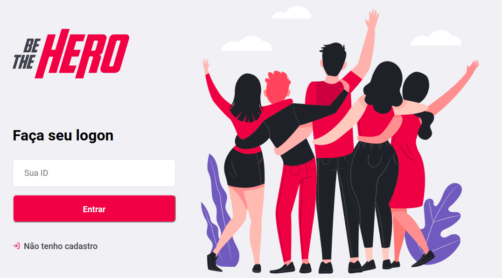

<h1 align="center">🚀 Be The Hero</h1>

<h4 align="center">
   Projeto da Semana OmniStack 11 da <a href="https://rocketseat.com.br/">Rocketseat</a>
</h4>

    <a href="#projeto">Projeto</a>&nbsp;&nbsp;&nbsp;|&nbsp;&nbsp;&nbsp;
    <a href="#objetivo">Objetivo</a>&nbsp;&nbsp;&nbsp;|&nbsp;&nbsp;&nbsp;
    <a href="#tecnologias">Tecnologias</a>&nbsp;&nbsp;&nbsp;|&nbsp;&nbsp;&nbsp;
    <a href="#ferramentas">Ferramentas</a>&nbsp;&nbsp;&nbsp;|&nbsp;&nbsp;&nbsp;
    <a href="#como-contribuir">Como contribuir</a>&nbsp;&nbsp;&nbsp;|&nbsp;&nbsp;&nbsp;
    <a href="#licença">Licença</a>

### Projeto

### Objetivo
O Be The Hero auxilia pessoas a encontrarem ONG's que possam ser ajudadas de forma facilitada.

### Tecnologias
<ul>
    <li><a href="https://nodejs.org/en/">Node.js</a></li>
    <li><a href="https://reactjs.org/">ReactJS</a></li>
    <li><a href="https://reactnative.dev/">React Native</a></li>
    <li><a href="https://expo.io/">Expo</a></li>
</ul>

### Ferramentas
<ul>
    <li><a href="https://code.visualstudio.com/">Visual Studio Code</a></li>
    <li><a href="https://insomnia.rest/">Insomnia</a></li>
    <li><a href="https://github.com/arb/celebrate">Celebrate</a></li>
    <li><a href="https://github.com/visionmedia/supertest">SuperTest</a></li>
    <li><a href="http://knexjs.org/">Knex</a></li>
</ul>

### Como contribuir

- Faça um fork desse repositório;
- Cria uma branch com a sua feature: `git checkout -b minha-feature`;
- Faça commit das suas alterações: `git commit -m 'feat: Minha nova feature'`;
- Faça push para a sua branch: `git push origin minha-feature`.

### Licença
Esse projeto está sob a licença MIT. Veja o arquivo [LICENSE](LICENSE.md) para mais detalhes.
